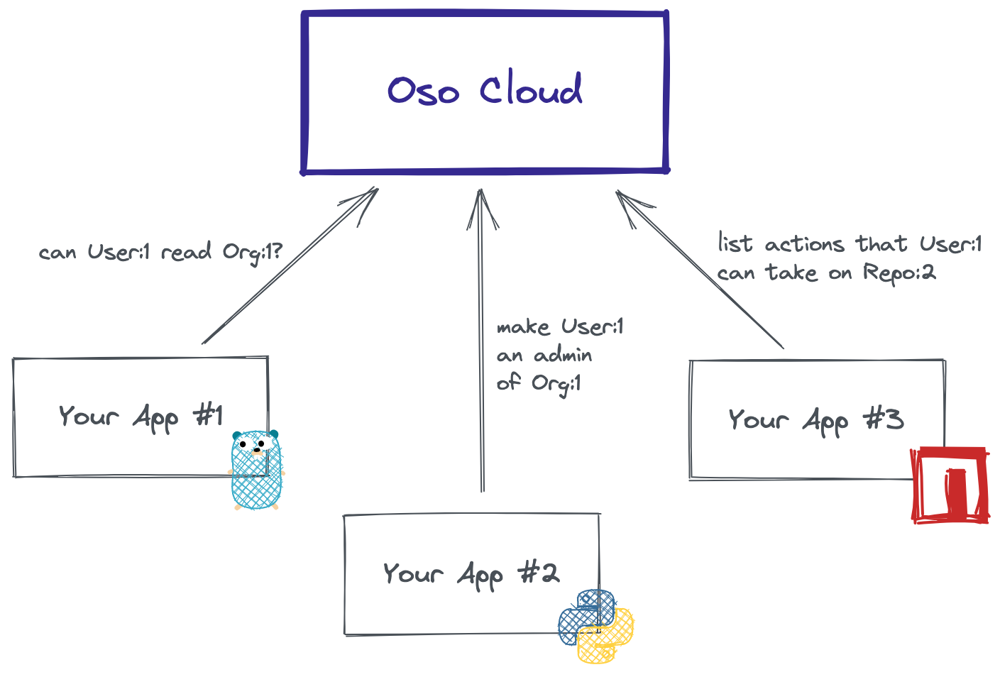

# Authorize Across Services

If you're performing authorization in multiple services, you'll need a way to share
authorization data (like roles or resource groups) between your applications.
Oso's authorization-as-a-service product, called [Oso Cloud](https://www.osohq.com/docs/), lets you store
authorization data and perform authorization from any of your applications. Like
the Oso Library, Oso Cloud is powered by [the Polar language](https://www.osohq.com/docs/reference/polar-syntax).

Here are some other resources that might be useful:

- [How Oso Cloud Works](https://www.osohq.com/docs/concepts/how-it-works): a
  high-level overview of how Oso Cloud enforces authorization in all of your services.
- [Authorization Academy Chapter
  VI](https://www.osohq.com/academy/microservices-authorization) discusses
  how to build an authorization system that works across multiple services.
- [Patterns for Authorization in
  Microservices](https://www.osohq.com/post/microservices-authorization-patterns):
  from the Oso engineering blog, a discussion of the most common patterns we've
  seen for modeling authorization data in a microservices environment.

### Set up a 1x1 with an Oso Engineer

Our team is happy to help you get started with Oso. If you'd like to learn more
about using Oso Cloud in your app or have any questions,
[schedule a 1x1 with an Oso engineer](https://calendly.com/osohq/1-on-1?utm_source=library_docs&utm_content=guides_cloud).
