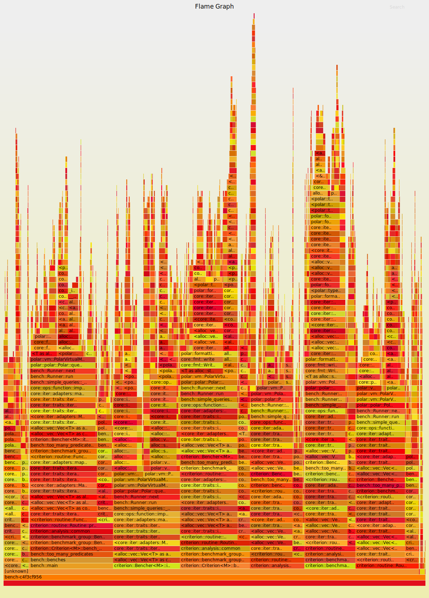

# Polar benchmarking

## Running the benchmarks

We are using [criterion](https://bheisler.github.io/criterion.rs/book/index.html) as our
benchmarking tool. This comes with its own benchmarking harness, but works fine with
cargo.

Run it using `cargo bench`. For a specific benchmark, pass in the name
specified as argument to the `benchmark_group` or `benchmark_function`.

E.g. `cargo bench -- n_plus_one`.

Example output looks like:

```
simple 1=1              time:   [2.5615 us 2.6109 us 2.6952 us]                        
                        change: [+0.7485% +1.7625% +3.1924%] (p = 0.00 < 0.05)
                        Change within noise threshold.
Found 7 outliers among 100 measurements (7.00%)
  6 (6.00%) high mild
  1 (1.00%) high severe

simple 1=1,2=2          time:   [8.3056 us 8.3316 us 8.3593 us]                            
                        change: [+3.4814% +3.9364% +4.4377%] (p = 0.00 < 0.05)
                        Performance has regressed.
```

This also outputs some graphical views in `target/criterion/report/index.html`.

The performance changes are measured locally against stored results. In the
future, we may want to add these to CI.


## Understanding where time is spent

One easy and visual way to see where Polar spends its time, is through using
[cargo-flamegraph](https://github.com/flamegraph-rs/flamegraph).

This can be installed with just `cargo install flamegraph`.

Although this is supposed to work with the cargo bench, it doesn't seem to
work with criterion.

So to run it, you will need to do something like:

`flamegraph target/release/deps/bench-123123abcdef --bench -n --profile-time 10`

(the `--bench` flag is expected by the runner, `--profile-time 10` runs it for 30 seconds 
without doing the analysis and `-n` turns off the graph plotting).

But it probably makes the most sense to run it for only a single benchmark:

`flamegraph target/release/deps/bench-123123abcdef --bench -n --profile-time 10 -- many_rules`

This captures a [perf](https://perf.wiki.kernel.org/index.php/Main_Page) file
which can be used directly, plus a SVG flamegraph. The latter looks something
like this:



Which is _really_ useful if you open it in a browser and interact with it. If you are viewing
this in Github, click on the image, and then view the raw file.
